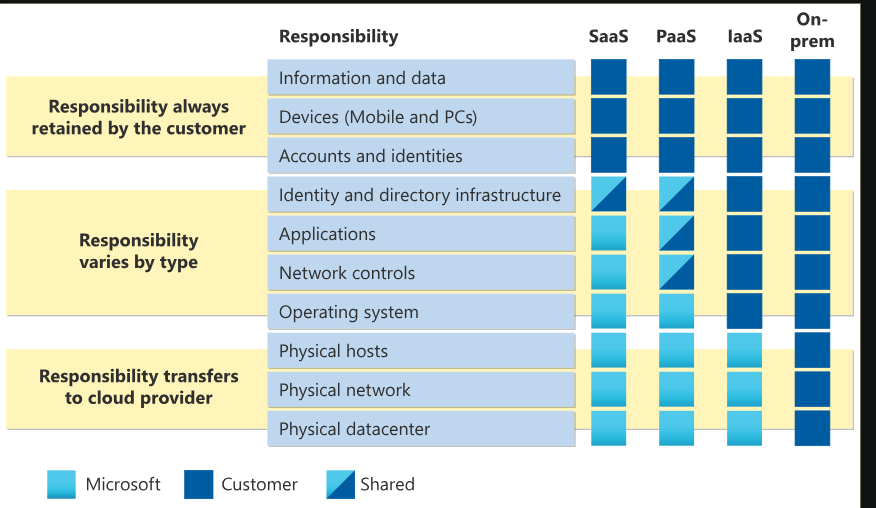
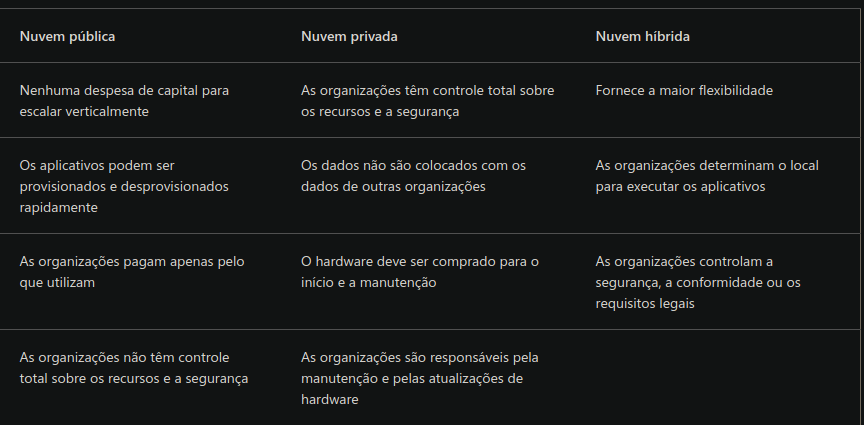

# Microsoft Azure Fundamental AZ-900

 O Microsoft Azure é uma plataforma de computação em nuvem com um conjunto de serviços em constante expansão para ajudar você a criar soluções para atingir suas metas de negócios. Os serviços do Azure dão suporte a tudo, do simples ao complexo. O Azure tem serviços Web simples para hospedar sua presença comercial na nuvem.

## Modelo de responsabilidade compartilhada

Com o modelo de responsabilidade compartilhada, as responsabilidades são compartilhadas entre o provedor de nuvem e o consumidor. Segurança física, energia, resfriamento e conectividade de rede são responsabilidade do provedor de nuvem. O consumidor não fica na mesma localização do datacenter, portanto, não faria sentido que o consumidor tivesse algumas dessas responsabilidades.

Ao mesmo tempo, o consumidor é responsável pelos dados e pelas informações armazenados na nuvem. O consumidor também é responsável pela segurança de acesso, o que significa que você só dá acesso àqueles que precisam.

Você sempre será responsável por:

- Informações e dados armazenados na nuvem
- Dispositivos que têm permissão para se conectar à nuvem (telefones celulares, computadores e assim por diante)
- Contas e identidades das pessoas, serviços e dispositivos em sua organização
- O provedor de nuvem é sempre responsável por:

Datacenter físico

- Rede física
- Hosts físicos
- Seu modelo de serviço determinará a responsabilidade por coisas como:

Sistemas operacionais

- Controles de rede
- Aplicativos
- Identidade e infraestrutura
  
## Modelos de nuvem

Nuvem privada

- Ela é uma nuvem (que fornece serviços de TI pela Internet) usada por uma única entidade.
- Uma nuvem privada pode ser hospedada em seu datacenter local. Ela também pode ser hospedada em um datacenter dedicado externo, até mesmo por terceiros que tenham dedicado esse datacenter à sua empresa.

Nuvem pública

- Uma nuvem pública é criada, controlada e mantida por um provedor de nuvem de terceiros. Com uma nuvem pública, qualquer pessoa que queira comprar serviços de nuvem pode acessar e usar os recursos. A disponibilidade pública geral é uma diferença fundamental entre nuvens públicas e privadas.

Nuvem híbrida

- Uma nuvem híbrida é um ambiente de computação que usa nuvens públicas e privadas em um ambiente interconectado.
  

## Azure Arc

O Azure Arc é um conjunto de tecnologias que ajuda a gerenciar seu ambiente de nuvem. O Azure Arc pode ajudar a gerenciar o seu ambiente de nuvem, seja uma nuvem pública exclusivamente no Azure, uma nuvem privada em seu datacenter, uma configuração híbrida ou até mesmo um ambiente de várias nuvens em execução em vários provedores de nuvem ao mesmo tempo.

## Modelo baseado em consumo

Ao comparar modelos de infraestrutura de TI, há dois tipos de despesas a serem consideradas. CapEx (despesas de capital) e OpEx (despesas operacionais).

A CapEx normalmente é uma despesa inicial única para comprar ou proteger recursos tangíveis. Um prédio novo, a repavimentação do estacionamento, a construção de um datacenter ou a compra de um veículo da empresa são exemplos de CapEx.

Ao contrário, a OpEx é o gasto de capital em serviços ou produtos ao longo do tempo. O aluguel de um centro de convenções, o leasing de um veículo da empresa ou a assinatura de serviços de nuvem são exemplos de OpEx.

A computação em nuvem se enquadra na OpEx porque opera em um modelo baseado em consumo.
