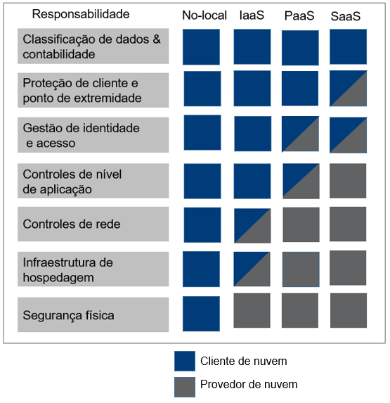
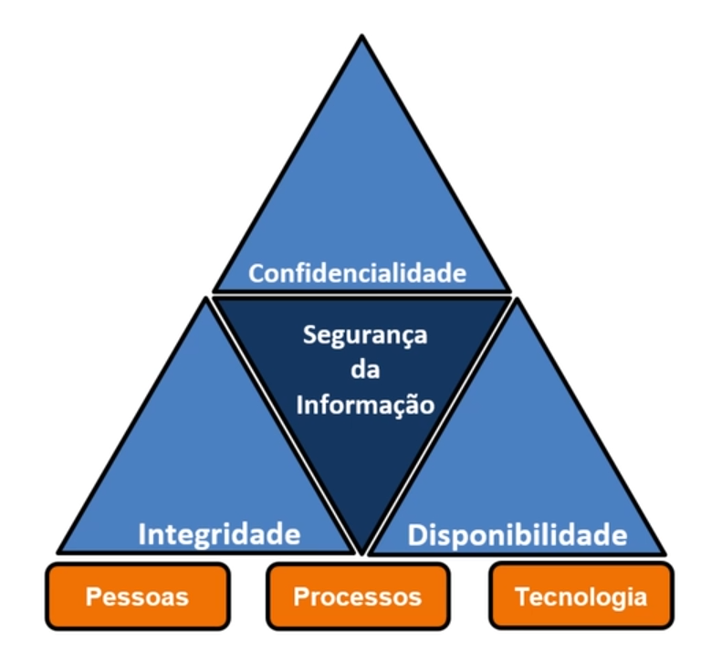

# Definições

## Responsabilidade compartilhada

## CIA

###  🔑 Criptografia simétrica:

- Usa a mesma chave

###  🔑 Criptografia assimétrica:

- Usa uma chave pública e uma privada

### 🎲 Conceitos de conformidade