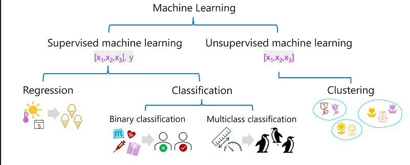

# Conceitos Fundamentais de IA

Em termos simples, IA é um software que imita comportamentos e funcionalidades humanas. As principais cargas de trabalho incluem:

- Machine learning – geralmente é a base de um sistema de IA e é como "ensinamos" um modelo de computador a fazer previsões e tirar conclusões com base nos dados.
- Pesquisa Visual Computacional: funcionalidades da IA para interpretar o mundo visualmente por meio de câmeras, vídeos e imagens.
- Processamento de linguagem natural: funcionalidades da IA para um computador interpretar a linguagem escrita ou falada e responder da mesma forma.
- Inteligência de documentos: funcionalidades da IA que lidam com o gerenciamento, o processamento e o uso de grandes volumes de dados encontrados em formulários e documentos.
- Mineração de conhecimento: funcionalidades da IA para extrair informações de grandes volumes de dados, muitas vezes não estruturados, para criar um repositório de conhecimento pesquisável.
- IA Generativa: funcionalidades da IA que criam conteúdo original em uma variedade de formatos, incluindo linguagem natural, imagem, código e muito mais.
  
## Como o machine learning funciona

A resposta é: com base nos dados.

## Machine learning no Microsoft Azure

O Microsoft Azure oferece o Serviço do Azure Machine Learning – uma plataforma baseada em nuvem para criar, gerenciar e publicar modelos de machine learning. O Estúdio do Azure Machine Learning oferece várias experiências de criação, como:

- Machine learning automatizado: esse recurso permite que quem não é especialista crie rapidamente um modelo de machine learning eficaz com base nos dados.
- Designer do Azure Machine Learning: uma interface gráfica que permite o desenvolvimento sem código de soluções de machine learning.
- Visualização de métricas de dados: analisar e otimizar seus experimentos com visualização.
- Notebooks: escreva e execute seu próprio código em servidores gerenciados do Jupyter Notebook que estão diretamente integrados ao estúdio.
  
## Serviços de Pesquisa Visual Computacional no Microsoft Azure

Você pode utilizar o Visão de IA do Azure da Microsoft para desenvolver soluções de visão computacional. Os recursos do serviço estão disponíveis para uso e teste no Estúdio do Visão do Azure e em outras linguagens de programação. Alguns recursos do Visão de IA do Azure incluem:

- Análise de imagens: funcionalidades para analisar imagens e vídeos e extrair descrições, marcas, objetos e textos.
- Detecção Facial: funcionalidades que permitem que você crie soluções de detecção e reconhecimento facial.
- Reconhecimento óptico de caracteres (OCR): funcionalidades para extrair texto impresso ou manuscrito de imagens, permitindo o acesso a uma versão digital do texto verificado.

## Noções básicas sobre o processamento de idioma natural

O NLP (processamento de idioma natural) é a área da IA que lida com a criação de software que entende o idioma escrito e falado.
O NLP permite que você crie um software que pode:

- Analisar e interpretar o texto em documentos, mensagens de email e outras fontes.
- Interpretar o idioma falado e sintetizar as respostas de fala.
- Traduzir automaticamente frases faladas ou escritas entre idiomas.
- Interpretar comandos e determinar as ações apropriadas.
  
## Inteligência de informação de documentos no Microsoft Azure

Você pode usar a IA do Azure para Informação de Documentos da Microsoft para criar soluções que gerenciam e aceleram a coleta de dados de documentos verificados. Os recursos da IA do Azure para Informação de Documentos ajudam a automatizar o processamento de documentos em aplicativos e fluxos de trabalho, aprimorar estratégias orientadas por dados e enriquecer recursos de pesquisa de documentos.

## Mineração de conhecimento

A mineração de conhecimento é o termo usado para descrever soluções que envolvem a extração de informações de grandes volumes de dados geralmente não estruturados, com o objetivo de criar um repositório de conhecimento pesquisável.

## IA Generativa no Microsoft Azure

- No Microsoft Azure, você pode utilizar o serviço Azure OpenAI para criar soluções de IA generativa. O Serviço OpenAI do Azure é a solução de nuvem da Microsoft para implantar, personalizar e hospedar modelos de IA generativa. Ele reúne o melhor dos modelos e APIs de ponta da OpenAI com a segurança e a escalabilidade da plataforma de nuvem do Azure.

## O que é aprendizado de máquina?

O aprendizado de máquina tem suas origens na estatística e na modelagem matemática de dados. A ideia fundamental do aprendizado de máquina é usar dados de observações anteriores para prever resultados ou valores desconhecidos. Por exemplo:

- O proprietário de uma sorveteria pode usar um aplicativo que combine o histórico de vendas e registros meteorológicos para prever quantos sorvetes provavelmente venderão em um determinado dia, com base na previsão do tempo.
- Um médico pode usar dados clínicos de pacientes anteriores para realizar testes automatizados que prevêem se um novo paciente corre risco de diabetes com base em fatores como peso, nível de glicose no sangue e outras medidas.
- Um pesquisador na Antártica pode usar observações anteriores para automatizar a identificação de diferentes espécies de pinguins (como Adelie , Gentoo ou Chinstrap ) com base em medições das nadadeiras, bico e outros atributos físicos de um pássaro.
  
## Aprendizado de máquina como uma função

Como o aprendizado de máquina é baseado em matemática e estatística, é comum pensar em modelos de aprendizado de máquina em termos matemáticos. Fundamentalmente, um modelo de aprendizado de máquina é um aplicativo de software que encapsula uma função para calcular um valor de saída com base em um ou mais valores de entrada. O processo de definição dessa função é conhecido como **treinamento** . Depois que a função for definida, você poderá usá-la para prever novos valores em um processo chamado **inferência**.

## Tipos de aprendizado de máquina

## Aprendizado de máquina supervisionado

Aprendizado de máquina supervisionado é um termo geral para algoritmos de aprendizado de máquina nos quais os dados de treinamento incluem valores de recursos e valores de rótulos conhecidos . O aprendizado de máquina supervisionado é usado para treinar modelos, determinando uma relação entre os recursos e os rótulos em observações anteriores, para que rótulos desconhecidos possam ser previstos para recursos em casos futuros.

### Regressão

A regressão é uma forma de aprendizado de máquina supervisionado em que o rótulo previsto pelo modelo é um valor numérico.

### Classificação

A classificação é uma forma de aprendizado de máquina supervisionado em que o rótulo representa uma categorização, ou classe . Existem dois cenários de classificação comuns.

### Classificação binária

Na classificação binária , o rótulo determina se o item observado é (ou não ) uma instância de uma classe específica. Ou dito de outra forma, os modelos de classificação binária prevêem um de dois resultados mutuamente exclusivos.

### Classificação multiclasse

A classificação multiclasse estende a classificação binária para prever um rótulo que representa uma das múltiplas classes possíveis.

## Aprendizado de máquina não supervisionado

A forma mais comum de aprendizado de máquina não supervisionado é o clustering . Um algoritmo de agrupamento identifica semelhanças entre observações com base em suas características e as agrupa em agrupamentos discretos. Por exemplo:

- Agrupe flores semelhantes com base no tamanho, número de folhas e número de pétalas.
- Identifique grupos de clientes semelhantes com base em atributos demográficos e comportamento de compra.
  
## A Regressão

Os modelos de regressão são treinados para prever valores de rótulos numéricos com base em dados de treinamento que incluem recursos e rótulos conhecidos. O processo para treinar um modelo de regressão (ou mesmo qualquer modelo de aprendizado de máquina supervisionado) envolve múltiplas iterações nas quais você usa um algoritmo apropriado (geralmente com algumas configurações parametrizadas) para treinar um modelo, avaliar o desempenho preditivo do modelo e refinar o modelo por repetir o processo de treinamento com diferentes algoritmos e parâmetros até atingir um nível aceitável de precisão preditiva.

## Métricas de avaliação de regressão

### Erro Médio Absoluto (MAE)

A variação neste exemplo indica quantos sorvetes cada previsão estava errada. Não importa se a previsão foi superior ou inferior ao valor real (por exemplo, -3 e +3 indicam uma variação de 3). Essa métrica é conhecida como erro absoluto para cada previsão e pode ser resumida para todo o conjunto de validação como erro absoluto médio (MAE).

### Erro Quadrático Médio (MSE)

A métrica de erro médio absoluto leva em consideração todas as discrepâncias entre os rótulos previstos e reais. No entanto, pode ser mais desejável ter um modelo que esteja consistentemente errado por uma pequena quantidade do que um que cometa menos erros, mas maiores. Uma maneira de produzir uma métrica que “amplifique” erros maiores elevando ao quadrado os erros individuais e calculando a média dos valores quadrados. Essa métrica é conhecida como erro quadrático médio (MSE).

### Erro quadrático médio raiz (RMSE)

O erro quadrático médio ajuda a levar em conta a magnitude dos erros, mas como eleva ao quadrado os valores dos erros, a métrica resultante não representa mais a quantidade medida pelo rótulo. Em outras palavras, podemos dizer que o MSE do nosso modelo é 6, mas isso não mede sua precisão em termos do número de sorvetes que foram mal previstos; 6 é apenas uma pontuação numérica que indica o nível de erro nas previsões de validação.

### Coeficiente de determinação (R 2 )

Todas as métricas até agora comparam a discrepância entre os valores previstos e reais para avaliar o modelo. Porém, na realidade, existe alguma variação aleatória natural nas vendas diárias de sorvete que o modelo leva em consideração. Em um modelo de regressão linear, o algoritmo de treinamento se ajusta a uma linha reta que minimiza a variância média entre a função e os valores conhecidos do rótulo. O coeficiente de determinação (mais comumente referido como R 2 ou R-Quadrado ) é uma métrica que mede a proporção de variância nos resultados da validação que pode ser explicada pelo modelo, em oposição a algum aspecto anômalo dos dados de validação (por exemplo, um dia com um número altamente incomum de vendas de sorvetes por causa de um festival local).

O cálculo para R 2 é mais complexo do que para as métricas anteriores. Ele compara a soma das diferenças quadradas entre os rótulos previstos e reais com a soma das diferenças quadradas entre os valores reais dos rótulos e a média dos valores reais dos rótulos, assim:

R 2 = 1- ∑(y-ŷ) 2 ÷ ∑(y-ȳ) 2

## Treinamento iterativo

As métricas descritas acima são comumente usadas para avaliar um modelo de regressão. Na maioria dos cenários do mundo real, um cientista de dados usará um processo iterativo para treinar e avaliar repetidamente um modelo, variando:

- Seleção e preparação de recursos (escolha de quais recursos incluir no modelo e cálculos aplicados a eles para ajudar a garantir um melhor ajuste).
- Seleção de algoritmo (exploramos a regressão linear no exemplo anterior, mas existem muitos outros algoritmos de regressão)
- Parâmetros de algoritmo (configurações numéricas para controlar o comportamento do algoritmo, mais precisamente chamados de hiperparâmetros para diferenciá-los dos parâmetros x e y ).
  
## A Classificação binária

A classificação, assim como a regressão, é uma técnica **supervisionada** de aprendizado de máquina; e, portanto, segue o mesmo processo iterativo de treinamento, validação e avaliação de modelos. Em vez de calcular valores numéricos como um modelo de regressão, os algoritmos usados para treinar modelos de classificação calculam valores de **probabilidade** para atribuição de classe e as métricas de avaliação usadas para avaliar o desempenho do modelo comparam as classes previstas com as classes reais.
